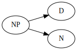
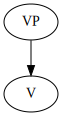
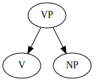
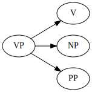
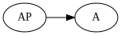
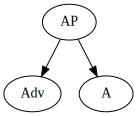
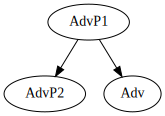
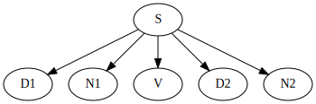
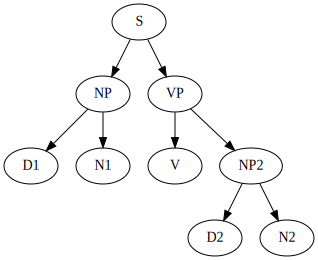

# Table of Contents

1.  [Englab](#org231e201)
    1.  [배경지식](#org8f83fbd)
        1.  [변형생성문법 이론](#orgb9fef9f)
        2.  [언어의 창조성](#orgbcff98a)
    2.  [통사론](#org06685d7)
        1.  [영어 문장의 기본성분](#orge2bb78d)

# Englab

## 배경지식

### 변형생성문법 이론

> 초기의 미국 구조주의는 행동주의 심리학에 바탕을 두고 있어 언어를 인간의 행동으로 보고, 언어습득도 자극과 반응의 관점에서 본다. 
> 그래서 구조주의 언어학에서 나온 언어교육 이론은 자극과 반응에 근거한 반복학습을 강조하였는데 그것은 언어의 학습과정을 습관의 형성으로 보았기 때문이다. 
> 언어습득이 습관형성이라는 구조주의의 주장을 강력하게 비판한 학자는 변형생성문법(Transformational Generate Grammar)의 창시자인 노암 촘스키이다. 
> 말을 배우는 어린 아이가 과거에 전혀 들어보지 않은 문장을 이해하고 말하는 것을 지적하면서 언어습득을 습관형성이나 또는 자극과 반응 이론으로 설명할 수 없다고 주장하였다.
> 촘스키는 인간이 언어를 후천적으로 학습하기보다는 선천적으로, 즉 유전적인 언어능력을 가지고 태어난다고 주장한다. 각 태어난 어린 아이의 머릿속에는 이미 인간의 언어를 말할 수 있는 모든 능력이 내재되어 있다는 것이다. 
> 어린 아이가 듣게 되는 말들은 잠재적 능력을 촉발시키는 역할을 한다. 즉 어린 아이에게 입력이되는 언어의 역할은 마치 씨가 자라서 식물이 될 때 필요한 햇빛이나 물과 같은 역할이라고 볼 수 있다&#x2026;
> **변형생성문법은 언어를 하나의 완벽한 규칙 체계로 본다.** 인간이 언어를 쉽게 배울 수 있는 것은 인간이 언어능력을 갖고 태어났고 그리고 언어가 규칙으로 되어 있다고 보기 때문이다. &#x2013; 영어통사론 - 변형생성문법 이론 중

### 언어의 창조성

> 구조주의 문법학자들은 언어의 습득을 습관형성 또는 모방으로 보고 반복학습을 중요시 여겼다. 그러나 촘스키는 매우 다른 언어습득과정을 제시한다. 
> 즉 어린아이는 이전에 자기가 전혀 듣지 못했던 문장을 이해하고 말한다는 것이다. 이러한 인간의 언어능력을 촘스키는 언어의 창조성이라고 하였다&#x2026; 어린아이가 규칙을 가지고 있다면 그 규칙에 의해 새로운 단어나 문장을 
> 생성할 수 있다. 즉, 언어의 규칙성이 언어의 창조성을 가능하게 한다&#x2026; 언어는 단순히 반복적으로 학습해서 습득되는 것이 아니고 인간의 내재적인 능력의 도움을 받아야 가능하다는 것을 보여준다. 이 내재적 능력은 규칙의 체계
> 이고 언어습득이란 이러한 체계를 내재화하는 과정이다. 변형생성문법에서는 이러한 규칙이 오직 문법적인 문장만을 생성하고, 그리고 문법적인 모든 문장은 생성한다고 한다. 이런점에서 이 규칙들의 체계를 생성문법이라고 한다. &#x2013; 영어통사론 - 언어의 창조성 중

## 통사론

### 영어 문장의 기본성분

1.  문법범주(Grammatical category)

    > **Morrie closed his eyes.**
    > 
    > 위 문장은 네 개의 단어로 이루어져 있다. 그러나 영어화자는 위 단어를 단순히 네 개의 어회로 이해하고 있지 않고 일정한 종류의 범주로 분류해서 이해하고 있다.
    > 이러한 단어의 범주는 문장의 구성을 쉽게 해준다. 즉 위 문장에서 Marrie는 명사이기 때문에 다른 명사가 그 자리를 대신할 수 있다. 그러나 동사나 지정어가 Marrie의 자리를 대신할 수는 없다&#x2026;
    > 어느 영어화자가 일만 개의 단어를 알고 있다는 것은 각각의 단어의 범주 정보도 알고 있다는 것을 말한다. 물론 이 지식을 명시적으로 표현할 수 있는 것은 아니어도 어떤 단어가 어느 자리에 있으면 좋은지 안 좋은지를 
    > 알 수 있다는 것이다. 이렇게 모든 단어는 특정한 문법범주(grammatical category)에 속해 있다. &#x2013; 영어통사론 - 영어문장의 기본성분 중
    
    -   명사(noun)
    -   동사(verb)
    -   형용사(adjective)
    -   부사(adverb)
    -   전치사(preposition)
    -   접속사(conjunction)
    -   지정어(determiner)
    
    > 문법범주는 어떻게 정의하는가? 가령, 전통문법이나 학교문법에서는 명사를 사물의 이름을 나타내는 품사로, 동사를 동작 및 행위를 나타내는 품사 등으로 정의한다. 그러나 동장 및 행위를 나타내는 명사도 있기 때문에
    > 이러한 정의는 문제에 직면한다. 가령 South Korea wants talks란 문장에서 talks는 명사지만 의미적으로는 행위를 나타낸다. 따라서 최근의 문법학자들은 의미에 근거한 정의보다는 단어가 출현하는 자리,
    > **즉 단어의 분포에 근거한 정의를 사용한다.**

2.  문장의 구성성분

    단어에 수식어가 붙어 더 큰 표현이 되는데, 무법범주는 변하지 않는다. 단어에서 층위를 한단계 상승하여 구로써 문장을 구성하는 경우가 이에 해당된다.
    
    -   명사구
        
        the boys
        
            digraph NounPhrase1 {
            NP -> {D N};
            }
        
        
        
        the tall boys
        
            digraph NounPhrase2 {
            NP -> {D A N};
            }
        
        
    
    -   동사구
        
        They {ate}.
        
            digraph VerbPhrase1 {
            rankdir=LR;
            VP -> V;
            }
        
        
        
        They {ate lunch}.
        
            digraph VerbPhrase2 {
            VP -> {V NP};
            }
        
        
        
        They {ate lunch in the cafe}.
        
            digraph VerbPhrase3 {
            VP -> {V NP PP};
            }
        
        
    
    -   형용사구
        
        The boy was {happy}.
        
            digraph AdjecticalPhrase1 {
            rankdir=LR;
            AP -> A;
            } 
        
        
        
        The boy was {very happy}.
        
            digraph AdjecticalPhrase2 {
            AP -> { Adv A };
            }
        
        
    
    -   부사구
        
        He works {very slowly}.
        
            digraph AdverbialPhrase1 {
            AdvP1 -> {AdvP2 Adv};
            } 
        
        
    
    -   조동사와 접속사
        
        조동사와 접속사는 일반적으로 구로 취급되지 않고 단어로 취급된다. 그리고 문장도 구로 취급된다.
    
    -   문장 분석
        
        The student met the professor.
        
            digraph WordLevel {
              S -> {D1 N1 V D2 N2};
            }
        
        단어 층위에서의 문장 분석 결과.
        
        
        
            digraph PhraseLevel {
              S -> {NP VP};
              NP -> {D1 N1};
              VP -> {V NP2};
              NP2 -> {D2 N2};
            } 
        
        

